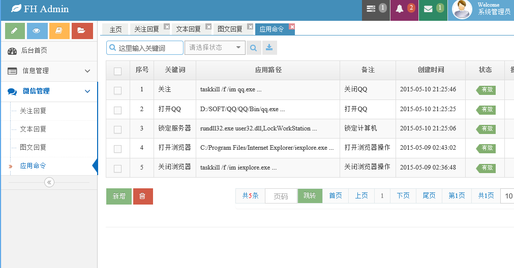

# at

支持三大数据库 mysql  oracle  sqlsever   更专业、更强悍、适合不同用户群体

    A 代码生成器(开发利器);
    
        增删改查的处理类，service层，mybatis的xml，SQL( mysql   和oracle)脚本,   jsp页面 都生成
    
        就不用写搬砖的代码了,生成的放到项目里，可以直接运行

    B 阿里巴巴数据库连接池druid;
        
        数据库连接池  阿里巴巴的 druid。Druid在监控、可扩展性、稳定性和性能方面都有明显的优势

    C 安全权限框架shiro ;
        
        Shiro 是一个用 Java 语言实现的框架，通过一个简单易用的 API 提供身份验证和授权，更安全，更可靠

    D ehcache 分布式缓存;
        
        是一个纯Java的进程内缓存框架，具有快速、精干等特点,广泛使用的开源Java分布式缓存。

    E 微信接口开发（后续会加入Activiti5 工作流 ）赠送一个jbpm工作流大型ERP系统(含OA、财务、分销)参考学习

    F  WebSocket 通信技术 （即时聊天、及时站内信并声音提醒、实时在线管理）

-------------------------------------------------------------------------------------------------------------------------

1. 模块化、服务化，流程化，耦合度低、扩展性好，灵活度高，工具类封装完整，干净利索，调用简单方便

2. 提供Rest服务，支持APP手机应用(android和ios)接口、php、.net、易语言、VB等第三方接口调用

3. 全新高大尚HTML5+css3.0+bootstrap响应式开发界面UI，( 手机 PC 平板 截图在下面)、前沿.  spring restful 风格

4. 框架搭建完善成熟，在此基础上做过很多项目，系统具有并发处理、分布式、稳定性。

5. 系统功能完善，此为框架平台，文档、注释齐全，提供技术支持，专门供二次开发

6. 在此基础上可二次开发(OA、ERP、CRM ,医疗管理、金融、网站后台、APP后台、电子商务、商城(赠送UI)等等

7.我们这边是公司，主要业务是定制开发,  此系统为我们平时给客户做项目用的，经过很多项目实战考验

###系统模块

1.   权限管理：点开二级菜单进入三级菜单显示 角色(基础权限)和按钮权限
      角色(基础权限): 分角色组和角色,独立分配菜单权限和增删改查权限。
      按钮权限: 给角色分配按钮权限。

2.   按钮管理：自定义按钮管理，维护按钮权限标识等

3.   菜单管理：无限级别自定义菜单，自定义菜单图标，业务菜单和系统菜单分离，菜单状态显示隐藏（递归处理）

4.   数据字典：无限级别，支持多级别无限分类。内设编号，排序等

5.   组织机构：无限级别，公司or部门管理

6.   在线管理：websocket技术，实时检测在线用户列表，统计在线人数,可强制用户下线 同一用户只能在一个客户端登录

7.   系统用户：对各个基本的用户增删改查，单发、群发站内信邮件短信，导入导出excel表格，批量删除

8.   会员管理：对前台用户管理，分配会员级别，到期时间，状态，联系信息等资料

9.   代码生成：生成完整的模块代码，并保留生成记录模版，可复用 （超强悍开发利器） 

10. 性能监控：监控整个系统的性能，SQL监控，SQL防火墙，URL监控，SPRING监控，SESSION监控等

11. 接口测试：POST or GET 方式检测系统接口，参数加密，json返回结果，计算服务器响应时间

12. 发送邮件：单发，群发邮件  

13. 置二维码：生成二维码图表保存到服务器 or  解析读取二维码内信息 

14. 图表报表：柱状图、饼状图、折线图、各种图表大全

15. 地图工具：打开地图, 鼠标点击地图某位置获取经纬度坐标，根据经纬度计算两点距离

16. 打印测试：页面打印预览测试

17. 图片管理：对批量上传的图片统一管理 ，点击放大，可打开多个，自由切换，绚丽预览效果

18. 站内信：收信箱和发信箱， websocket技术通讯技术做的及时收信提醒，可配置语音提示来信 

19. 系统设置：修改系统名称，邮件服务器配置，短信账号设置，图片水印配置，微信配置

20. 及时聊天：打开聊天窗口，可群聊、一对一聊天

菜单权限：分配给每个角色不同的菜单权限, 每个角色看到的菜单不同，无限级别菜单

按钮权限：独立分配不同的角色不同的功能权限，增删改查权限分配具体到不同的菜单，自定义按钮管理

支持多用户分权限管理后台,  权限具体到不同的菜单不同的按钮

###信息模块(小项目代码中)

`新闻管理`：新闻的维护、发布、权重排序等 采用百度ueditor富文本框

`公告管理`：公告的维护、发布

`广告管理`：广告的维护、发布，状态维护，上传广告图片

`友情链接`：友情链接的维护、状态维护

`特别推荐`：特别推荐、状态维护

###微信模块

`关注回复`：微信用户关注公众号回复

`文本回复`：匹配关键词进行文本回复

`图文回复`：匹配关键词进行图文回复

`应用命令`：匹配关键词进行命令操作，例如微信发送命令，执行服务器重启、关机、锁定等操作

-------------------------------------------------------------------------------------------------------------------------

###技术点

    1. 导出 导入 excel 文件

    2  导出word文件

    3. IO 流上传下载文件
    
    4. 群发邮件，可以发html、纯文本格式，可以发给任意邮箱(实现批量发送广告邮件)
    
    5. 群发or单独 发送短信，支持两种第三方短信商接口
    
    6. spring   aop  事物处理
    
    7. 代码生成器 (freemarker)， 代码 zip 压缩打包
    
    8. MD5加密 SHA加密（登录密码用此加密）接口加密身份校验
    
    9. 数据库连接池  阿里的 druid。Druid在监控、可扩展性、稳定性和性能方面都有明显的优势,支持并发
    
    10.加入安全框架 shiro (登录授权)(session管理)
    
    11.根据汉字 解析汉字的全拼(拼音)和首字母(导入excel到用户表，根据用户的汉字姓名生成拼音的用户名)
    
    12.app接口@ResponseBody（支持与其它语言数据交互）
    
    13.极光推送 (推送给APP及时消息，APP不启动也能收到)
    
    14.微信接口(身份验证，文本、图文回复等) 微信远程控制服务器重启、锁定、其它应用程序
    
    15.java Quartz 定时器 （定时执行某程序，精确到秒，可设置周期）
    
    16.java websocket 即时通讯技术，点对点，群聊，单聊
    
    17.新增Lucene全文检索
    
    18.Base64传输图片
    
    19.图片加水印(图片水印，文字水印）
    
    20.生成 or  解析 二维码
    
    21.HTML5 + JAVAEE  WebSocket 通信技术，WebSocket 验证用户登录，强制某用户下线
    
    22.批量异步上传图片，可预览，有进度条，支持拖拽上传(百度webuploader )。列表动态滑动放大展示。
    
    23.ehcache 自定义二级缓存 ，选择缓存存放目录，处理并发，增加系统性能
    
    24.服务器内部GET POST 请求
    
    25.uploadify 上传插件，单条、批量上传多线程，带进度条，异步，图片、视频, 其它文件格式均可上传
    
    26.地图选点获取经纬度坐标，根据俩经纬度计算距离
    
    27.tab标签页面功能，标签自由切换，不重复操作数据库
    
    28.站内信语音提醒，js控制音频播放
    
 -------------------------------------------------------------------------------------------------------------------------

系统框架为：springmvc + mybaits  有 maven 版本和 非maven 版本 jdk 1.6 1.7 1.8  tomcat 6 7 8

数据库：oracle  、msyql 、sqlsever (2005及以上版本均支持)  【 spring3.0 和 spring4.02  mybaits 3.2】     

开发工具：myeclipse  eclipse idea 均可, 使用没有限制

赠送 同UI   springmvc + hibernate  Spring Security  Lucene Quartz MySQL、Oracle、SQL Server

赠送 同UI  maven 分模块项目 springmvc + mybatis

赠送完整微信公众平台源码_多用户_可直接用来招代理【进入查看】

